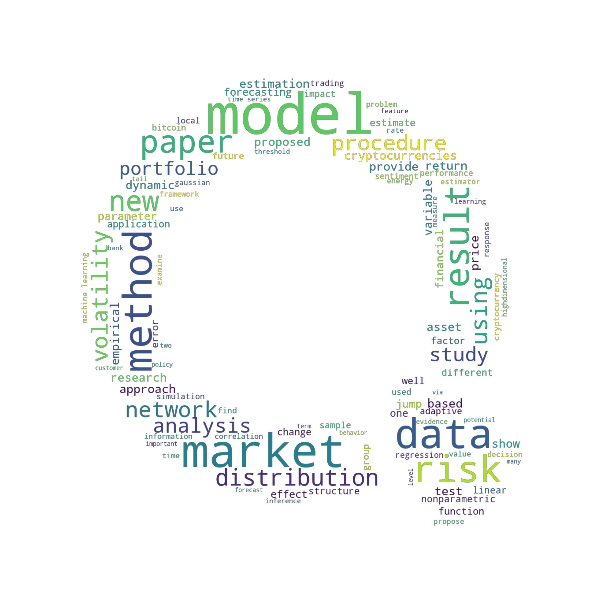

[](http://quantlet.de/)

## [](http://quantlet.de/) **DEDA_class2019_SYSU_Abstract_LDA_wordcloud** [](http://quantlet.de/)

```yaml

Name of Quantlet: DEDA_class2019_SYSU_Abstract_LDA_wordcloud

Published in:  LN_SDA_2019

Description: Create a word cloud picture to make a short description of 130 abstracts

Keywords: word cloud, topic modelling, abstract analysis

See also: SL_2019_alpha_centauri_pirates_wordcloud

Author: FB, FS

```




### PYTHON Code
```python

import matplotlib.pyplot as plt
import re
from nltk.corpus import stopwords
import os
from os import path
from PIL import Image
from wordcloud import WordCloud, STOPWORDS
import numpy as np

# Please change the working directory to your path!
# os.chdir("/Users/xinwenni/LDA-DTM/xmas_song")
sub_dir = os.getcwd() + '/DEDA_class2019_SYSU_Abstract_LDA_wordcloud/'
cwd_dir = sub_dir if os.path.exists(sub_dir) else os.getcwd()  # the path you save your files

raw_text = open(cwd_dir + 'Abstract_all.txt', 'r', encoding='utf-8').read()
raw_text = str(raw_text)
raw_text = re.sub('\n', ' ', raw_text)

cleantextprep = str(raw_text)

# keep only letters, numbers and whitespace
expression = "[^a-zA-Z0-9 ]"
cleantextCAP = re.sub(expression, '', cleantextprep)  # apply regex
cleantext = cleantextCAP.lower()  # lower case

with open(cwd_dir + "Output_total.txt", "w")as text_file:
    text_file.write(str(cleantext))

# Read the whole text.
with open(path.join(cwd_dir, 'Output_total.txt'), 'r', encoding='utf-8', errors='ignore') as outout_file:
    text = outout_file.readlines()

# Mask
# xmas_tree_pic = np.array(Image.open(path.join(cwd_dir, "xmas_tree2.png")))
ql_pic = np.array(Image.open(cwd_dir + 'QuantletsLogo_Ring.jpg'))

# Optional additional stopwords
stopword = set(STOPWORDS)
stopword = stopword.union({'abstract', 'keywords', 'sep'})

# Construct Word Cloud
# no backgroundcolor and mode = 'RGBA' create transparency
wc = WordCloud(max_words=100, stopwords=stopword, mask=ql_pic, mode='RGBA', background_color=None)

# Pass Text
wc.generate(text[0])

# store to file
plt.figure(figsize=(10,10))
plt.imshow(wc, interpolation='bilinear')
plt.axis("off")
plt.show()
plt.savefig(cwd_dir + "wordcloud_abstract.png", dpi=300, transparent=True)
```

automatically created on 2020-03-29