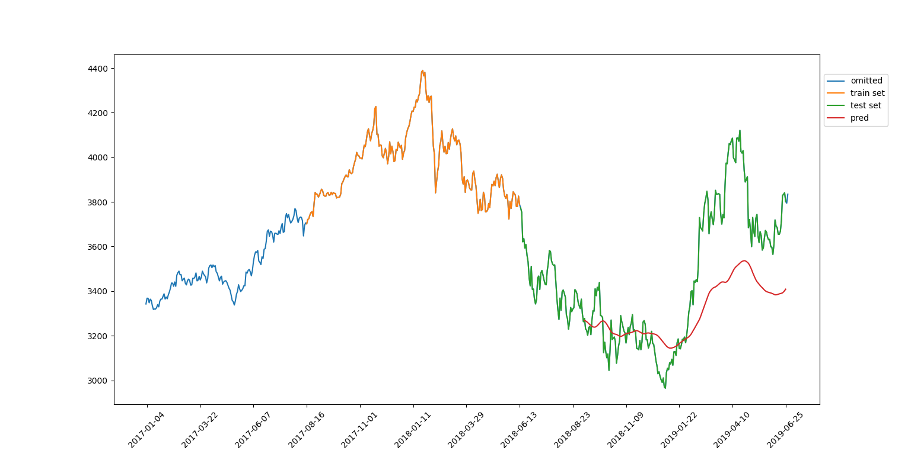
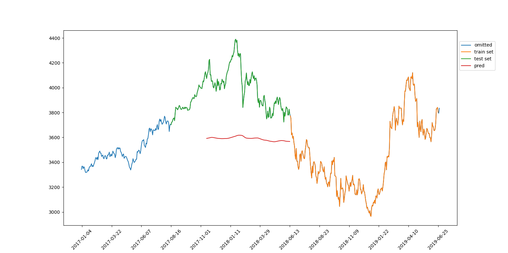

[](http://quantlet.de/)

## [](http://quantlet.de/) **DEDA_class2019_SYSU_LSTMPrediction** [](http://quantlet.de/)

```yaml

Name of Quantlet: DEDA_class2019_SYSU_LSTMPrediction
Published in: LN_SDA_2019
Description: 'Use LSTM to predict stock price.The main steps are:
  1. import tensorflow 
  2. transform data format 
  3. create training data and testing data 
  4. use LSTM to fit the model 
  5. predict
  6. plot results (blue: omitted, orange: train set, green: test set, red: prediction)
  note that the evaluation of the LSTM fit depends on the training interval. For fun we trained from the "future" in the 2nd train valley plot.'
Keywords: 'LSTM, prediction, stock, training, tensorflow, plot, KERAS'
Author: Rainy Wang, WK Härdle, Justin Hellermann

```



