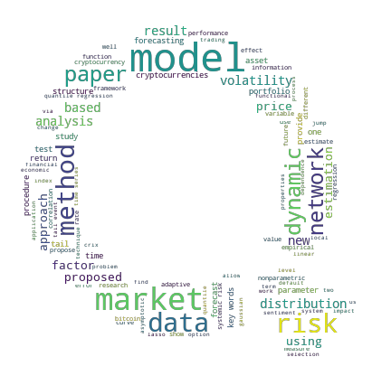

[](http://quantlet.de/)

## [](http://quantlet.de/) **FB_2019_Abstract_Analysis** [](http://quantlet.de/)

```yaml

Name of Quantlet: FB_2019_Abstract_Analysis

Published in:  LN_SDA_2019

Description: Collect 130 abstracts and create a word cloud picture to make a short description of these 130 abstracts; Summarize 5 topics from 60 abstracts with LDA method

Keywords: LDA, word cloud, topic modelling, abstract analysis

See also: LDA-DTM_Christmas Songs, SL_2019_alpha_centauri_pirates_wordcloud

Author: FB, FS

```


